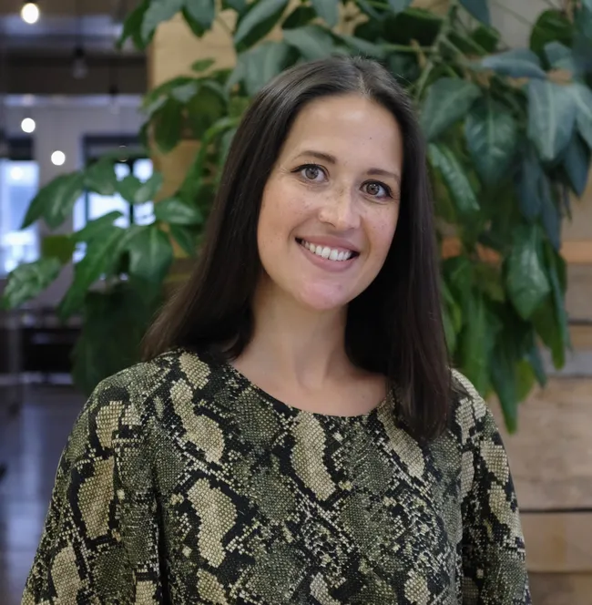

# Torchbox Constitution

    

        <svg class="swirls__icon" width="100%" height="100%" viewBox="0 0 1512 1239" fill="none" xmlns="http://www.w3.org/2000/svg" aria-hidden="true" focusable="false">
            <g clip-path="url(#clip0_10543_57583)">
                <g opacity="0.3">
                    <path d="M386.911 -1863.33C335.715 -1864.4 309.973 -1825.29 348.614 -1805.63C581.091 -1689.6 764.122 -1540.76 803.738 -1445.66L775.651 -1448.42C-1042.6 -1611.2 -2290.83 -901.081 -2671.39 -645.024C-2708.31 -620.893 -2672.23 -583.642 -2621 -592.488C-1932.47 -717.168 -1362.24 -589.766 -887.799 -219.967C-801.263 -150.001 -685.412 -71.2064 -566.404 -2.01501C-566.404 -2.01501 -429.339 80.8479 -231.715 165.694L-239.219 168.921C-599.844 266.335 -990.056 257.739 -1201.05 242.958C-1251.61 239.973 -1282.96 276.548 -1251.19 297.513C-1096.7 395.966 -773.901 570.438 -378.259 631.118C579.026 776.719 1691.37 519.197 2157.41 -65.5266C2179.36 -93.1108 2136.37 -119.145 2090.12 -105.844C1935.13 -65.5551 1730.9 -51.9129 1481.24 -76.4417C903.881 -133.165 153.197 -603.464 153.197 -603.464C153.197 -603.464 1156.42 -901.449 1733.77 -844.726C1986.56 -819.89 2169.32 -768.228 2288.96 -700.958C2324.48 -681.606 2381.36 -697.828 2377.71 -725.945C2323.13 -1343.97 1525.24 -1709.86 992.983 -1805.77C758.993 -1848.59 533.626 -1858.83 386.911 -1863.33Z" fill="var(--color--grey-5)" style="mix-blend-mode:screen"/>
                </g>
                <g opacity="0.03">
                    <path d="M1066.63 1428.41C1010.06 1409.04 1030.4 1359.86 1096.3 1355.71C1490.02 1333 1870.76 1257.91 2030.55 1179.08L1996.84 1170.62C-166.142 607.248 -639.638 -597.31 -735.315 -1003.92C-745.479 -1042.66 -660.692 -1065.33 -616.277 -1036.09C-26.4958 -637.358 745.804 -536.652 1713.01 -715.358C1892.52 -750.457 2114.53 -782.647 2328.14 -804.022C2328.14 -804.022 2578.06 -831.797 2895.79 -837.387L2891.66 -843.592C2622.27 -1084.39 2190.49 -1231.5 1944.56 -1300.96C1886.3 -1318.16 1897.47 -1367.06 1957.56 -1375.25C2245.48 -1411.59 2808.62 -1456.42 3310.36 -1358.97C4522.85 -1121.97 5406.64 -421.98 5190.13 345.771C5179.88 381.977 5101.44 390.733 5067.88 359.047C4950.16 257.126 4746.5 162.081 4446.82 86.8903C3753.81 -86.9873 2364.75 81.5241 2364.75 81.5241C2364.75 81.5241 3080.95 778.247 3773.96 952.125C4077.39 1028.26 4338.24 1049.75 4550.16 1030.54C4612.32 1025.46 4653.75 1064.29 4615.22 1090.81C3795.76 1684.02 2484.23 1729.8 1791.67 1612.91C1486.41 1562.17 1230.53 1482.46 1066.63 1428.41Z" fill="var(--color--grey-50)" style="mix-blend-mode:screen"/>
                </g>
            </g>
            <defs>
                <clipPath id="clip0_10543_57583">
                    <rect width="1512" height="1239" />
                </clipPath>
            </defs>
        </svg>
    
    

    At Torchbox, we're proud to be employee-owned. When a company is owned
    and run by the people who work for it, it can serve not just the pursuit
    of profit, but also people, purpose, and long-term impact.

Torchbox isn't privately owned by shareholders or publicly listed; it is
owned by the people who work here, through an Employee Ownership Trust
(EOT) that holds 100% of the company's shares on behalf of all
co-owners. We don't just do the work, we also have a voice in how the
business is run, how rewards are shared, and how the future is shaped.

Co-owners get to benefit from profit sharing, representation, and
influence without holding shares in their own name.

_International Associates_, who work with us long-term in countries
where we don't have a legal entity, are, as much as possible, treated
like co-owners - they participate in profit sharing, voting in Trustee
Director elections, and are part of our internal communications and
events.

Profit still matters, but not at any cost. We aim for sufficient profit:
enough to sustain the business, invest in its future, and reward the
co-owners who help create it.

This Constitution turns our ownership model into something practical and
accountable. It reflects the particular values that have shaped our
approach to employee ownership. It may not look the same as the model
used by other EO businesses.

The Constitution is built to last, focusing on principles rather than
policies. Day-to-day details can be found on the intranet. It is a
reference for understanding how things work, resolving questions, or
addressing concerns. It can be used to hold ourselves, fellow co-owners,
and leadership to account. It won't answer everything, but it will
provide guidance. It is a reference, not a page-turner; something to
return to whenever we need it, and it helps us to stay aligned with the
principles on which the business was built.

Employee ownership is a learning journey, so this Constitution is a work
in progress. It will evolve to safeguard our company and strengthen our
culture for the Co-owners of the future.

  

  

  

  

  

  

